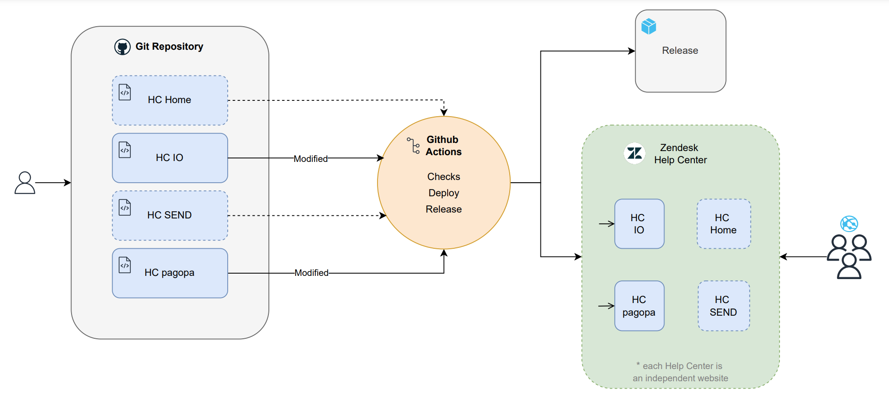

<p align="center">
   
   <a href="https://github.com/pagopa/as-help-center/actions/workflows/release.yml">
      
   </a>
   
   
</p>

# as-help-center

1. [What is the Help Center project?](#what-is-the-help-center-project)
2. [Architecture](#architecture)
   - [Main technologies used](#main-technologies-used)
   - [Terminology](#terminology)
3. [Getting Started](#getting-started)
   - [Prerequisites](#prerequisites)
   - [Installation](#installation)
   - [Run the application](#run-the-application)
   - [Customizing the application](#customizing-the-application)
   - [Publishing the application](#publishing-the-application)
4. [Contributing](#contributing)

## What is the Help Center project?
The project provides a centralized **Help Center** for troubleshooting, designed as a unique and recognizable point of reference for all [PagoPA](https://www.pagopa.it/it/) products. The main goal is to reduce support requests by enhancing self-resolution capabilities for citizens and improving user experience, operational efficiency, and service quality.


## Architecture



Each folder of the repository corresponds to the Help Center Platform for a specific PagoPA product, and each of them is built and deployed using Zendesk Help Center Stack.
We have, for now, 4 product folder named as `hc_<brand_name>`:
- **hc_home** (Root portal for accessing the actual Help Center for PagoPA products)
- **hc_io** (Help center for the [IO App](https://io.italia.it/) product) --> [website](https://assistenza.ioapp.it/hc/it)
- **hc_send** (Help center for [SEND Servizio Notifiche Digitali](https://notifichedigitali.pagopa.it/it/) product)
- **hc_pagopa** (Help center for the [pagopa](https://www.pagopa.gov.it/) product)

**Common assets**\
At root level you can find the "common_assets" folder. This folder includes all assets used by each brands. These files will be included inside the brand source at local start, local upload, release action (deploy)

**Folder structure**\
Each brand folder follows the defined structure for Zendesk Help Center themes:

- **templates/**: Contains .hbs files with the HTML templates for the help center.
- **assets/**: Includes CSS, JavaScript, and image files.
- **settings/**: Stores theme settings and configuration files.
- **manifest.json**: Defines metadata and version information for the theme.
- **script.js** and **style.css**: Define global js scripts and global css
- **.env**: Defines Zendesk env var to authenticate and start/deploy the app.

**CI/CD pipeline**\
The project is managed via a CI/CD pipeline that ensures code integrity and efficient deployment. Key features include: code validation for every pull request, automatic deployment to Zendesk Help Center Library for modified brands when a pull request is merged into the main branch, deployment is limited to the folders (Brands) affected by the changes, ensuring optimized workflows and selective updates.\
See [release](docs/extendings/release.md) process in details.\
See also [CMS property synchronization](docs/extendings/sync-properties.md) process.

### Main technologies used
- HTML/CSS/js
- [Curlybars](https://github.com/zendesk/curlybars)
- [Zendesk Help Center Templating](https://support.zendesk.com/hc/en-us/articles/4408832681626-Help-center-templating-cookbook)
- Github Actions

### Terminology
When you read **"Brand"** we refer to the Help Center Platform for a specific PagoPA product, related to a specific repository folder.


\
<br/>
## Getting started
This is an example of how you may setting up and run your project locally for development purposes.

### Prerequisites
- Node and npm (the node version is stored in the .nvmrc file, we recommend to use [nvm](https://github.com/nvm-sh/nvm) to quickly install and use different versions of node)
- [ZCLI](https://developer.zendesk.com/documentation/apps/getting-started/using-zcli/#installing-and-updating-zcli)

### Installation
```bash
# install and use node version defined in the .nvmrc file
nvm install && nvm use

# install dependencies needed and prepare the working directory
npm install

# change the values in the .env file for each brand’s folder (<folder>/.env)
# enter your Zendesk account email, your Zendesk API token, the Brand’s subdomain, and the Brand ID
ZENDESK_EMAIL=<your_email@example.com>
ZENDESK_API_TOKEN=<your_api_token>
ZENDESK_SUBDOMAIN=<brand_subdomain>
BRAND_ID=<brand_id>
```

### Run the application
You can run the app locally (with hot reload enabled) for each Brand by executing the script:\
`./start-app.sh`

In this case, you will be prompted interactively to select the Brand you wish to start.\
Alternatively, you can skip the interactive Brand selection step by providing (as input) the folder corresponding to the Brand you want to start:\
`./start-app.sh hc_io`

### Customizing the application
You can modify a Brand by editing the files located in the specific folder related to the Brand. Specifically, the HTML code in the .hbs files within the folder `<folder_brand>/templates/`.\
Refer to the [Zendesk Help Center resources](https://support.zendesk.com/hc/en-us/articles/4408839332250-Customizing-your-help-center-theme) for more information.

### Publishing the application
You can upload the app from your local environment to the Zendesk Theme Library for a Brand, by executing the script:\
`./upload-app.sh`

In this case, you will be prompted interactively to select the Brand you wish to upload.\
Alternatively, you can skip the interactive Brand selection step by providing the folder (as input) corresponding to the Brand you want to upload:\
`./upload-app.sh hc_io`

> [!NOTE]
> This script only imports the app into the Theme Library, it does not publish the theme to production to make it visible externally. To publish the app to production you need to use the "release" GitHub Action or merge a PR into the main branch.


\
<br/>
## Contributing
We use [conventional commits](https://conventionalcommits.org/) to improve readability of the project history and to automate the release process. The commit message should therefore respect the following format:

```
<type>[optional scope/task]: <description>

[optional body]

[optional footer(s)]
```

- type: describes the category of the change. See [supported types](docs/extendings/commit-types.md).
- scope/task: (optional) describes what is affected by the change
- description: a small description of the change
- body: (optional) additional contextual information about the change
- footer: (optional) adds external links, references and other meta-information

i.e.:

```
chore: automate release
fix(styles): fix button padding
feat(CACI-101): add auto focus to fields with errors
```

We use [husky](https://github.com/typicode/husky) and [commitlint](https://github.com/conventional-changelog/commitlint) to validate messages when commiting.

We use [Github actions](https://github.com/features/actions) together with [semantic-release](https://github.com/semantic-release/semantic-release) to release a new version once a PR gets merged into main branch. To achieve this, there is also a check for the [Branch and Pull Request name](docs/extendings/branch-pr-name.md)

> [!IMPORTANT]  
> Before opening a PR to the main branch, remember to update the version in the **manifest.json** files for the modified brands that you want to publish (follow major, minor, patch conventions).
